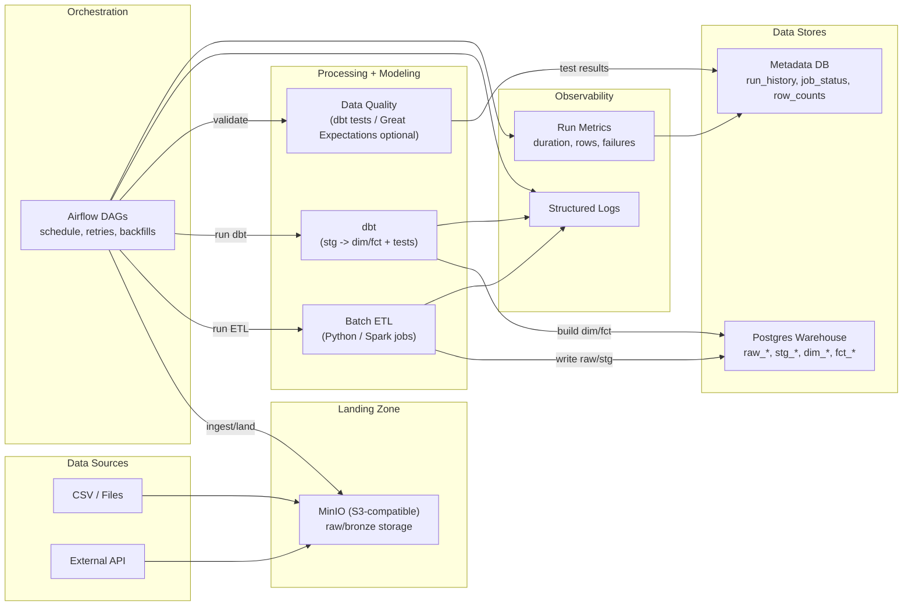

```mermaid
flowchart LR
  %% -------------------
  %% SOURCES
  %% -------------------
  subgraph SRC[Data Sources]
    CSV["CSV / Files"]
    API["External API"]
  end

  %% -------------------
  %% LANDING ZONE
  %% -------------------
  subgraph LZ[Landing Zone]
    S3["MinIO (S3-compatible)\nraw/bronze storage"]
  end

  %% -------------------
  %% ORCHESTRATION
  %% -------------------
  subgraph ORCH[Orchestration]
    AF["Airflow DAGs\nschedule, retries, backfills"]
  end

  %% -------------------
  %% PROCESSING + MODELING
  %% -------------------
  subgraph PROC[Processing + Modeling]
    ETL["Batch ETL\n(Python / Spark jobs)"]
    DBT["dbt\n(stg -> dim/fct + tests)"]
    DQ["Data Quality\n(dbt tests / Great Expectations optional)"]
  end

  %% -------------------
  %% WAREHOUSE + METADATA
  %% -------------------
  subgraph DATA[Data Stores]
    WH["Postgres Warehouse\nraw_*, stg_*, dim_*, fct_*"]
    META["Metadata DB\nrun_history, job_status, row_counts"]
  end

  %% -------------------
  %% OBSERVABILITY
  %% -------------------
  subgraph OBS[Observability]
    LOGS["Structured Logs"]
    METRICS["Run Metrics\nduration, rows, failures"]
  end

  %% FLOW
  CSV --> S3
  API --> S3

  AF -->|ingest/land| S3
  AF -->|run ETL| ETL
  ETL -->|write raw/stg| WH

  AF -->|run dbt| DBT
  DBT -->|build dim/fct| WH

  AF -->|validate| DQ
  DQ -->|test results| META

  AF --> LOGS
  AF --> METRICS
  ETL --> LOGS
  DBT --> LOGS
  METRICS --> META
```
