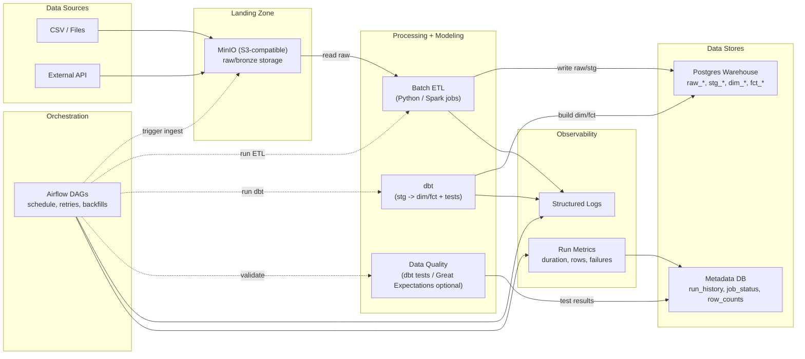

## Architectural flow (what happens in order)
1. **Batch ingestion**: source data → MinIO `raw/` prefix (partitioned paths).
2. **Orchestration**: Airflow DAG triggers ingestion/ETL/dbt/tests and records results.
3. **Modeling**: dbt builds `stg_*` then `dim_*` / `fct_*` tables in the warehouse.
4. **Tests**: dbt tests validate constraints (not_null/unique/relationships).
5. **Run history**: write run-level metrics + status for observability and debugging.
6. **CI**: pull requests run basic checks (format/lint + dbt compile/tests as applicable).

