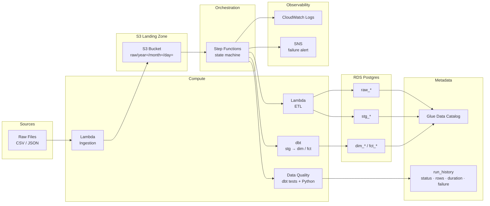

# Architecture

## Flow

1. **Ingestion** — Lambda drops raw source files into S3 bronze zone (partitioned paths)
2. **Orchestration** — Step Functions state machine triggers each stage in order with retry + failure handling
3. **ETL** — Lambda reads from S3, cleans and types the data, writes to Redshift `raw_*` and `stg_*` tables
4. **Modeling** — dbt builds `dim_*` and `fct_*` Gold layer tables from staging
5. **Data quality** — dbt tests + custom Python checks validate constraints; failures written to `run_history`
6. **Observability** — all stages emit structured logs to CloudWatch; SNS fires on any pipeline failure
7. **Metadata** — Glue Data Catalog tracks table schemas and partitions
8. **CI** — every push runs dbt compile + lint via GitHub Actions

---

## Diagram

```mermaid
flowchart LR

  subgraph SRC[Sources]
    FILES["Raw Files\nCSV / JSON"]
  end

  subgraph BRONZE[S3 Landing Zone]
    S3["S3 Bucket\nraw/year=/month=/day="]
  end

  subgraph ORCH[Orchestration]
    SF["Step Functions\nstate machine"]
  end

  subgraph COMPUTE[Compute]
    L1["Lambda\nIngestion"]
    L2["Lambda\nETL"]
    DBT["dbt\nstg → dim / fct"]
    DQ["Data Quality\ndbt tests + Python"]
  end

  subgraph WAREHOUSE[RDS Postgres]
    RAW["raw_*"]
    STG["stg_*"]
    GOLD["dim_* / fct_*"]
  end

  subgraph META[Metadata]
    CATALOG["Glue Data Catalog"]
    HISTORY["run_history\nstatus · rows · duration · failure"]
  end

  subgraph OBS[Observability]
    CW["CloudWatch Logs"]
    SNS["SNS\nfailure alert"]
  end

  FILES --> L1
  L1 --> S3
  S3 --> SF

  SF --> L2
  L2 --> RAW
  L2 --> STG

  SF --> DBT
  DBT --> GOLD

  SF --> DQ
  DQ --> HISTORY

  SF --> CW
  SF --> SNS

  RAW & STG & GOLD --> CATALOG
```
